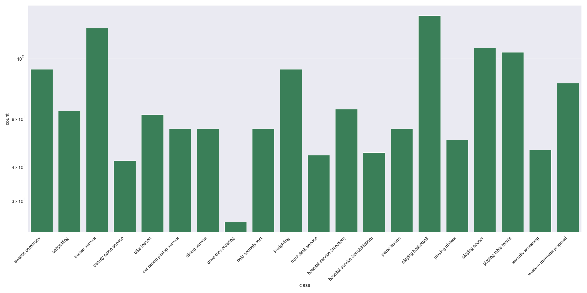
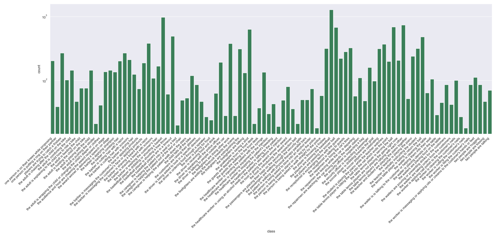
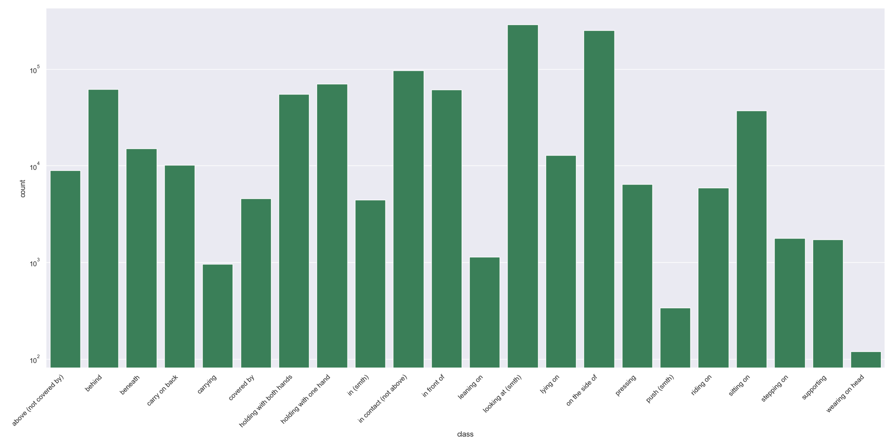
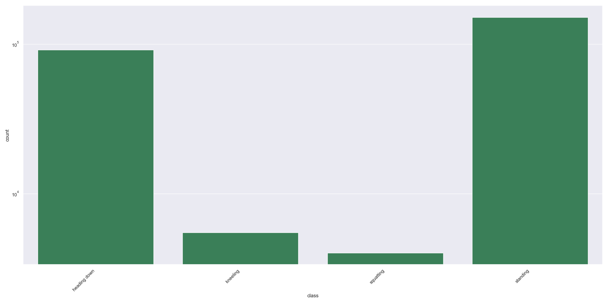
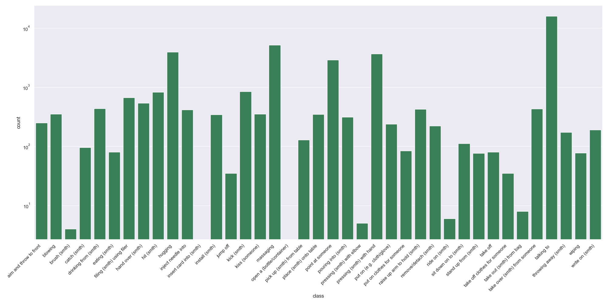
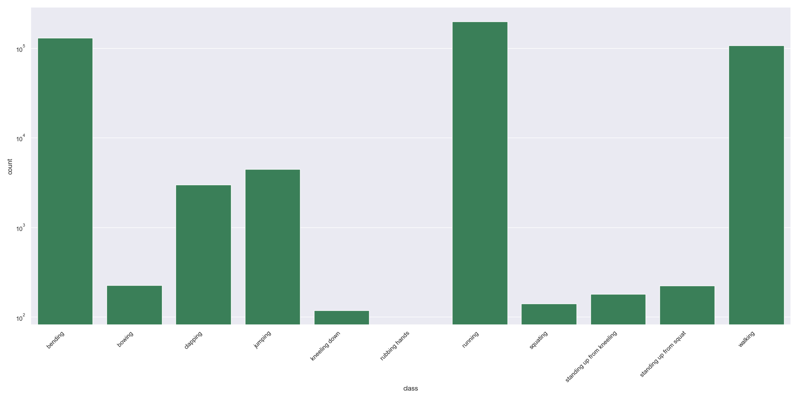

# MOMA
MOMA is a dataset dedicated to multi-object, multi-actor activity recognition. 


## Requirements

- Python 3.9+
- ffmpeg: For data processing.
- Torchvision 0.11.0+: For data loading and visualization.
- [distinctipy](https://github.com/alan-turing-institute/distinctipy): For data visualization. Install by running `pip install distinctipy`.
- NetworkX: Install by running `pip install networkx`.
- Graphvis: Install by running `sudo apt-get install graphviz graphviz-dev` and `pip install pygraphviz`.
## Hierarchy
| Level | Concept                                              | Representation                                                 |
|-------|------------------------------------------------------|----------------------------------------------------------------|
| 1     | Activity                                             | Semantic label                                                 |
| 2     | Sub-activity                                         | Temporal boundary and semantic label                           |
| 3     | Higher-order interaction                             | Spatial-temporal scene graph                                   |
|       | ┗━&emsp;Entity                                       | Graph node w/ bounding box, instance label, and semantic label |
|       | &emsp;&emsp;┣━&emsp;Actor                            | -                                                              |
|       | &emsp;&emsp;┗━&emsp;Object                           | -                                                              |
|       | ┗━&emsp;Description                                  | Graph edge w/ semantic label                                   |
|       | &emsp;&emsp;┗━&emsp;State                            | -                                                              |
|       | &emsp;&emsp;&emsp;&emsp;┣━&emsp;Attribute            | Loop                                                           |
|       | &emsp;&emsp;&emsp;&emsp;┗━&emsp;Relationship         | Directed edge                                                  |
|       | &emsp;&emsp;┗━&emsp;Atomic action                    | -                                                              |
|       | &emsp;&emsp;&emsp;&emsp;┣━&emsp;Intransitive action  | Loop                                                           |
|       | &emsp;&emsp;&emsp;&emsp;┗━&emsp;Transitive action    | Directed edge                                                  |


## Annotations
In this version, we include:
- 1,411 **activity** instances from [20 activity classes](https://raw.githubusercontent.com/d1ngn1gefe1/momatools/main/figures/activity.png?token=GHSAT0AAAAAABQHYNY25PBBGA4AIBT52DAAYPUG5AQ).
- 15,436 **sub-activity** instances from [97 sub-activity classes](https://raw.githubusercontent.com/d1ngn1gefe1/momatools/main/figures/sub_activity.png?token=GHSAT0AAAAAABQHYNY2CEGAIBK5KOSZLLPWYPUG6EQ).
- 156,790 **higher-order interaction** instances.
- 599,843 image **actor** instances and 98,325 video **actor** instances from [27 classes](https://raw.githubusercontent.com/d1ngn1gefe1/momatools/main/figures/actor.png?token=GHSAT0AAAAAABQHYNY3YODQHWF6ZEIKXHVGYPUG6WQ).
- 338,990 image **object** instances and 46,034 video **object** instances from [269 classes](https://raw.githubusercontent.com/d1ngn1gefe1/momatools/main/figures/object.png?token=GHSAT0AAAAAABQHYNY2S2BOY2KXIIHDBSPIYPUG6YA).
- 951,543 **relationship** instances from [22 classes](https://raw.githubusercontent.com/d1ngn1gefe1/momatools/main/figures/relationship.png?token=GHSAT0AAAAAABQHYNY3YR77CAOVI5JQBNZCYPUG7MA).
- 251,779 **attribute** instances from [4 classes](https://raw.githubusercontent.com/d1ngn1gefe1/momatools/main/figures/attribute.png?token=GHSAT0AAAAAABQHYNY2KBQJLZ5BPJH7EKIKYPUG7PQ).
- 38,666 **transitive action** instances from [39 classes](https://raw.githubusercontent.com/d1ngn1gefe1/momatools/main/figures/transitive_action.png?token=GHSAT0AAAAAABQHYNY3VTPGYBKO52XBPEUUYPUG7WQ).
- 412,914 **intransitive action** instances from [11 classes](https://raw.githubusercontent.com/d1ngn1gefe1/momatools/main/figures/intransitive_action.png?token=GHSAT0AAAAAABQHYNY2O4HYZFXUG3S7M5UMYPUG7XA).

Below, we show the syntax of the MOMA annotations.
```json5
[
  {
    "file_name": str,
    "num_frames": int,
    "width": int,
    "height": int,
    "duration": float,

    // an activity
    "activity": {
      "id": str,
      "class_name": str,
      "start_time": float,
      "end_time": float,
      
      "sub_activities": [
        // a sub-activity
        {
          "id": str,
          "class_name": str,
          "start_time": float,
          "end_time": float,
          
          "higher_order_interactions": [
            // a higher-order interaction
            {
              "id": str,
              "time": float,
              
              "actors": [
                // an actor
                {
                  "id": str,
                  "class_name": str,
                  "bbox": [x, y, width, height]
                },
                ...
              ],
              
              "objects": [
                // an object
                {
                  "id": str,
                  "class_name": str,
                  "bbox": [x, y, width, height]
                },
                ...
              ],
              
              "relationships": [
                // a relationship
                {
                  "class_name": str,
                  "source_id": str,
                  "target_id": str
                },
                ...
              ],
              
              "attributes": [
                // an attribute
                {
                  "class_name": str,
                  "source_id": str
                },
                ...
              ],
              
              "transitive_actions": [
                // a transitive action
                {
                  "class_name": str,
                  "source_id": str,
                  "target_id": str
                },
                ...
              ],
              
              "intransitive_actions": [
                // an intransitive action
                {
                  "class_name": str,
                  "source_id": str
                },
                ...
              ]
            }
          ]
        },
        ...
      ]
    }
  },
  ...
]
```

## Class distribution
### Activity

### Sub-activity

### Actor

### Object

### Relationship

### Attribute

### Transitive action

### Intransitive action

