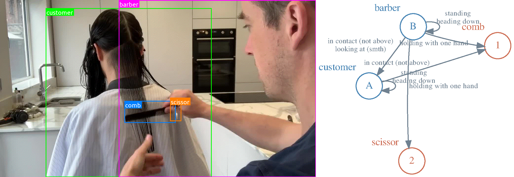
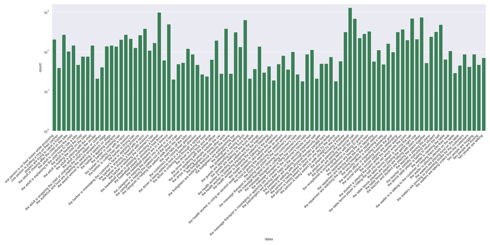
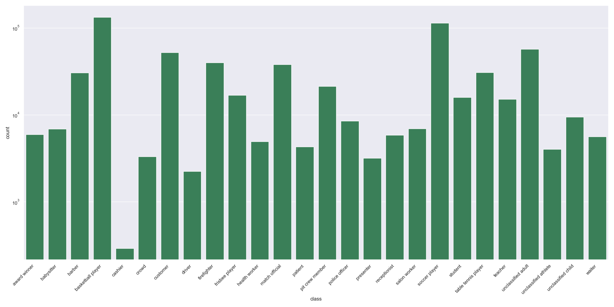
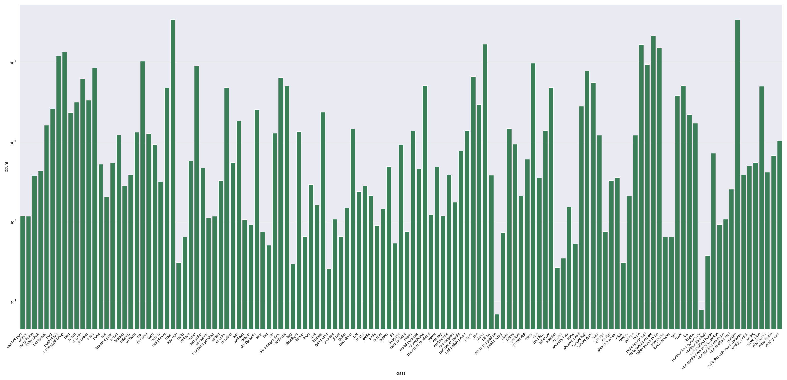
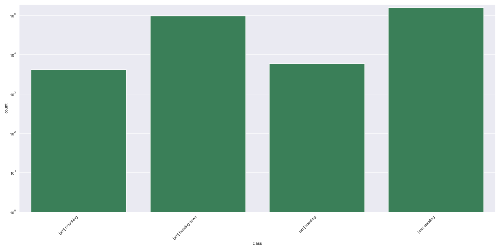
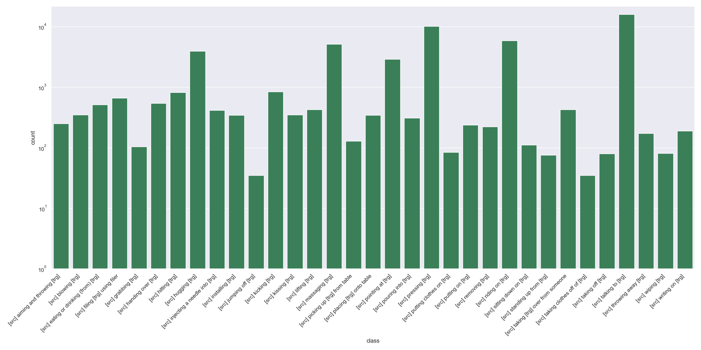
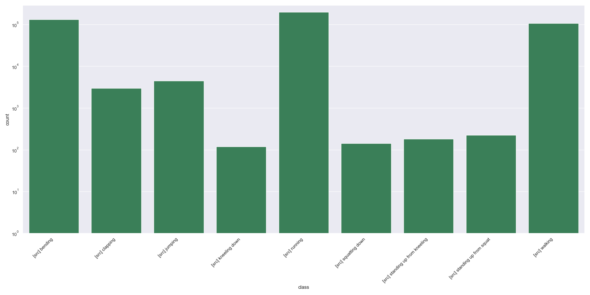

<div align="center">




**A dataset dedicated to multi-object, multi-actor activity parsing.**
  
[[Website]](https://moma.stanford.edu/)
[[Documentation]](https://momaapi.rtfd.io)
[[MOMA 1.0 Paper]](https://proceedings.neurips.cc/paper/2021/file/95688ba636a4720a85b3634acfec8cdd-Paper.pdf)


___
</div>


## Contents
- [Installation](#installation)
- [MOMA Hierarchy](#moma-hierarchy)
- [Dataset Statistics](#dataset-statistics)
  - [Class Distributions](#class-distributions)
- [Dataset Layout](#dataset-layout)
- [Annotation Schema](#annotation-schema)

## Installation

#### System Requirements:

- Python 3.7+
- Graphviz: `sudo apt-get install graphviz graphviz-dev` (Linux) or `brew install graphviz` (Mac)

To install all the dependencies needed for MOMA-LRG and then install the MOMA API code:

```
git clone https://github.com/d1ngn1gefe1/moma
cd moma
pip install -r requirements.txt
pip install -e .
```


## Getting Started
This section explains how to download, set up, and verify the MOMA-LRG dataset and its API.

#### Download
A script is provided to crawl raw videos in full resolution:
```
python download/videos.py --dir-moma [path to MOMA-LRG]
```

You can download the annotations with our script or directly from [Google Drive](https://drive.google.com/file/d/1stizUmyHY6aNxxbxUPD5DvoibBvUrKZW/view?usp=sharing):
```
python download/anns.py --dir-moma [path to MOMA-LRG]
```

#### Verification
The downloaded files should be unpacked into the required [dataset layout](#dataset-layout). To verify the dataset layout, as well as to validate and compile the dataset API, run
```
python scripts/validate.py
```


## MOMA Hierarchy

| Level | Concept&nbsp;&nbsp;&nbsp;&nbsp;&nbsp;&nbsp;&nbsp;&nbsp;&nbsp;&nbsp;&nbsp;&nbsp;&nbsp;&nbsp;&nbsp;&nbsp;&nbsp;&nbsp;&nbsp;&nbsp;&nbsp;&nbsp;&nbsp;&nbsp;&nbsp;&nbsp;&nbsp; | Representation |
| ----- | -------------------------------- | ---------------------------------------------------------------|
| 1     | Activity                         | Semantic label                                                 |
| 2     | Sub-activity                     | Temporal boundary and semantic label                           |
| 3     | Atomic action                    | Spatial-temporal scene graph                                   |
|       | ┗━&emsp;Entity                   | Graph node w/ bounding box, instance label, and semantic label |
|       | &emsp;&emsp;┣━&emsp;Actor        | Same as above                                                  |
|       | &emsp;&emsp;┗━&emsp;Object       | Same as above                                                  |
|       | ┗━&emsp;Predicate                | A tuple containing a predicate and its associated entities     |
|       | &emsp;&emsp;┗━&emsp;Relationship | A triple `(source node, semantic label, and target node)` that appears as a directed edge on an activity graph |
|       | &emsp;&emsp;┗━&emsp;Attribute    | A double `(source node, semantic label)` that appears as a semantic label for a graph node on an activity graph |


## Dataset Statistics

In this version, we include:

- 148 hours of videos
- 1,412 **activity** instances from [20 activity classes](https://raw.githubusercontent.com/d1ngn1gefe1/momatools/main/figures/activity.png?token=GHSAT0AAAAAABQHYNY25PBBGA4AIBT52DAAYPUG5AQ) ranging from 31s to 600s and with an average duration of 241s.
- 15,842 **sub-activity** instances from [91 sub-activity classes](https://raw.githubusercontent.com/d1ngn1gefe1/momatools/main/figures/sub_activity.png?token=GHSAT0AAAAAABQHYNY2CEGAIBK5KOSZLLPWYPUG6EQ) ranging from 3s to 31s and with an average duration of 9s.
- 161,265 **higher-order interaction** instances.
- 636,194 image **actor** instances and 104,564 video **actor** instances from [26 classes](https://raw.githubusercontent.com/d1ngn1gefe1/momatools/main/figures/actor.png?token=GHSAT0AAAAAABQHYNY3YODQHWF6ZEIKXHVGYPUG6WQ).
- 349,034 image **object** instances and 47,494 video **object** instances from [126 classes](https://raw.githubusercontent.com/d1ngn1gefe1/momatools/main/figures/object.png?token=GHSAT0AAAAAABQHYNY2S2BOY2KXIIHDBSPIYPUG6YA).
- 984,941 **relationship** instances from [19 classes](https://raw.githubusercontent.com/d1ngn1gefe1/momatools/main/figures/relationship.png?token=GHSAT0AAAAAABQHYNY3YR77CAOVI5JQBNZCYPUG7MA).
- 261,249 **attribute** instances from [4 classes](https://raw.githubusercontent.com/d1ngn1gefe1/momatools/main/figures/attribute.png?token=GHSAT0AAAAAABQHYNY2KBQJLZ5BPJH7EKIKYPUG7PQ).
- 52,072 **transitive action** instances from [33 classes](https://raw.githubusercontent.com/d1ngn1gefe1/momatools/main/figures/transitive_action.png?token=GHSAT0AAAAAABQHYNY3VTPGYBKO52XBPEUUYPUG7WQ).
- 442,981 **intransitive action** instances from [9 classes](https://raw.githubusercontent.com/d1ngn1gefe1/momatools/main/figures/intransitive_action.png?token=GHSAT0AAAAAABQHYNY2O4HYZFXUG3S7M5UMYPUG7XA).


### Class Distributions
This section presents the class distributions of the concepts described in this paper.

| Concept | Distribution | Concept | Distribution | 
| ------- | ------------ | ------- | ------------ |
| Activity |  | Sub-activity |  |
| Actor |  | Object |  |
| Relationship |  | Attribute |  |
| Transitive Action |  | Intransitive Action |  |


## Dataset Layout

Download the dataset into a directory titled `dir_moma` with the structure below. 
The `anns` directory requires roughly 1.8GB of space and the `video` directory requires 436 GB.
You may not require all the folders in `videos` depending on the nature of your project.

```shell
$ tree dir_moma
.
├── anns/
│    ├── anns.json
│    ├── splits/
│    │    ├── standard.json
│    │    └── few_shot.json
│    └── taxonomy/
│         ├── act_sact.json, cn2en.json, few_shot.json, lvis.json
│         └── actor.json, object.json, intransitive_action.json, transitive_action.json, attribute.json, relationship.json
└── videos/
     ├── raw/ (full-resolution untrimmed videos)
     ├── activity_fr/ (full-resolution activity videos)
     ├── activity/ (low-resolution activity videos)
     ├── sub_activity_fr/ (full-resolution sub-activity videos)
     ├── sub_activity/ (low-resolution sub-activity videos)
     ├── interaction/ (full-resolution atomic action frames extracted at 1fps)
     ├── interaction_frames/
     └── interaction_video/
```


## Annotation Schema
Below, we show the schema of the MOMA-LRG annotations.

```json5
[
  {
    "file_name": str,
    "num_frames": int,
    "width": int,
    "height": int,
    "duration": float,

    // an activity
    "activity": {
      "id": str,
      "class_name": str,
      "start_time": float,
      "end_time": float,

      "sub_activities": [
        // a sub-activity
        {
          "id": str,
          "class_name": str,
          "start_time": float,
          "end_time": float,

          "higher_order_interactions": [
            // a higher-order interaction
            {
              "id": str,
              "time": float,

              "actors": [
                // an actor
                {
                  "id": str,
                  "class_name": str,
                  "bbox": [x, y, width, height]
                },
                ...
              ],

              "objects": [
                // an object
                {
                  "id": str,
                  "class_name": str,
                  "bbox": [x, y, width, height]
                },
                ...
              ],

              "relationships": [
                // a relationship
                {
                  "class_name": str,
                  "source_id": str,
                  "target_id": str
                },
                ...
              ],

              "attributes": [
                // an attribute
                {
                  "class_name": str,
                  "source_id": str
                },
                ...
              ],

              "transitive_actions": [
                // a transitive action
                {
                  "class_name": str,
                  "source_id": str,
                  "target_id": str
                },
                ...
              ],

              "intransitive_actions": [
                // an intransitive action
                {
                  "class_name": str,
                  "source_id": str
                },
                ...
              ]
            }
          ]
        },
        ...
      ]
    }
  },
  ...
]
```
